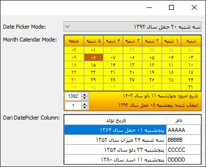

# Afghan-Calender
C# Windows form beautiful Dari language calendar

# Calendar
این پروژه به دلیل وجود نداشتن یک تقویم مناسب برای زبان دری به همراه مناسب های متناسب با فرهنگ و مردم کشور عزیزم افغانستان بر اساس پروژه های سورس باز تهیه و ساخته شده امیدوارم که مورد استفاده دوستان قرار بگیرد

**با تشکر از طراح اصلی این کامپوننت**

# Description
لطفاه سورس کد را بخوانیید همه چیز واضح است و میتانید با دات نت ۴.۸ باز کنید پروژه را